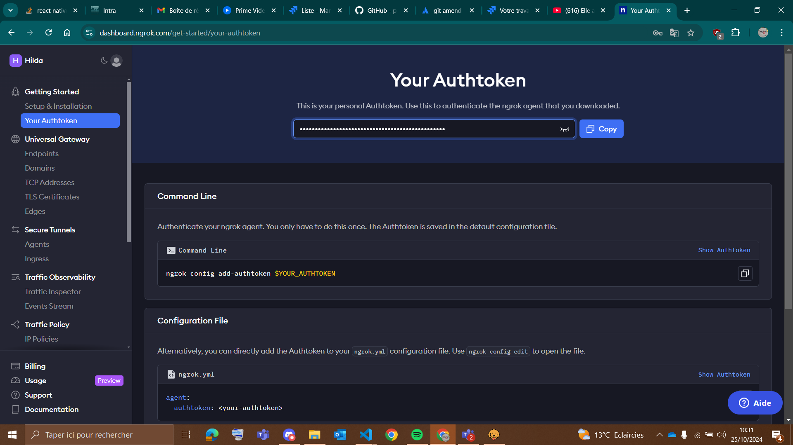
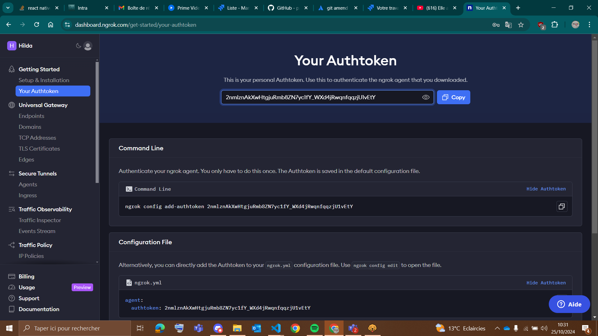
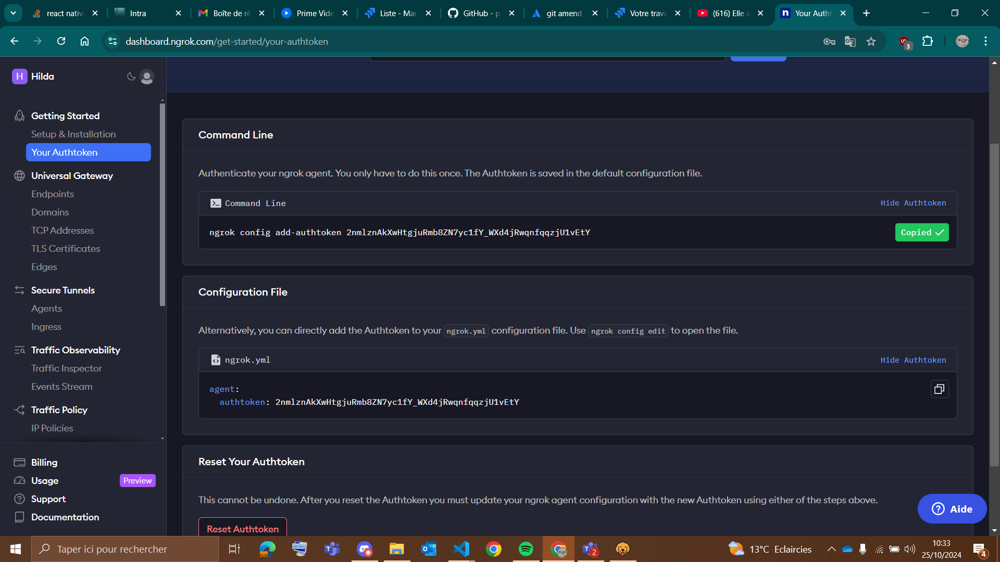
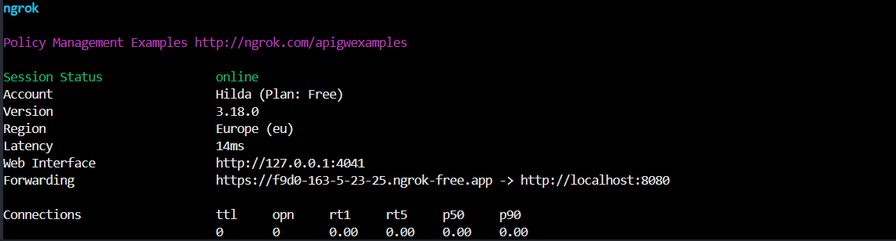

# **Accès API sur téléphone**

Etant donné que le téléphon ene reconnait pas le localhost du pc (logique en soi),
pour accéder à l'api sur mobile avec expo il faut faire les manipulations suivantes :

## Installer ngrok
(ça va permettre de créer un tunnel entre votre localhost et un lien externe,en gros donner 
une ip publique avec laquelle vous pourrez accéder à votre localhost)

Pour mac: 
`brew install ngrok/ngrok/ngrok`

Pour linux:
`curl -sSL https://ngrok-agent.s3.amazonaws.com/ngrok.asc | sudo tee /etc/apt/trusted.gpg.d/ngrok.asc >/dev/null && echo "deb https://ngrok-agent.s3.amazonaws.com buster main" | sudo tee /etc/apt/sources.list.d/ngrok.list && sudo apt update && sudo apt install ngrok`

ou plus simple pour linux: 
`npm install ngrok`

## Ngrok configuration

Une fois installé, il faut s'inscrire et configurer ngrok avec le token d'authetification présent sur votre compte. 
le token est récupérable sur le site de ngrok dans le dashboard.  

`ngrok config add-authtoken <TOKEN>`

Vous pouvez aussi juste cooller la commande avec le token. 

## CLI configuration on terminal

Ensuite, il faut lancer ngrok en spécifiant le port sur lequel tourne votre serveur.
`ngrok http <PORT>` dans notre cas `ngrok http http://localhost:8080`

## On your app

Une fois lancé, vous aurez un lien externe qui vous permettra d'accéder à votre localhost depuis votre téléphone, ça devrait ressembler à ça : 

Et dans Api.tsx vous remplacez l'url du client par l'url donnée par ngrok.
(L'adresse donnée dans le forwarding)
ex: export const client = new Client("https://b0f2-163-5-23-25.ngrok-free.app");